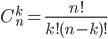
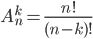

# Combination and permutation calculator

<h3>DEMO: https://xrafffcode.github.io/kpk/</h3>

## Formulas
### Combination:

### Permutation:

## Usage
Filling data:
- Fill 2 inputs <b>k</b> and <b>n</b> following by two simple rules (according to the formula you selected):
  - N number needs to be bigger than number K (If you are calculating combination)
  - N needs to be bigger or equal to K (If you are calculating permutation)

